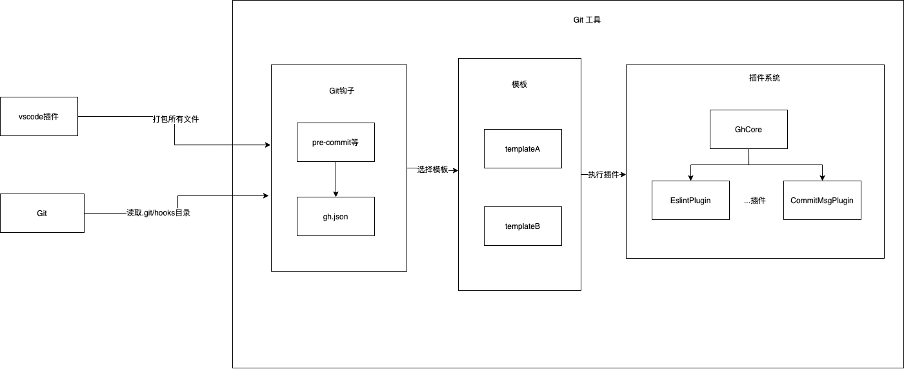

# 简介

node 版本的 git hooks 模板库

## 目录结构

```shell
.
├── assets
│   └── git-hooks
│       ├── commit-msg // git脚本入口
│       ├── gh.json // git脚本配置文件，指定对应的template模板
│       ├── pre-commit // git脚本入口
│       └── templates // 各类模板
│           └── template1 // 默认模板
├── rollupConfig // 打包配置
│   ├── rollup.cjs.js
│   └── rollup.common.js
├── src // 插件系统
│   ├── constants.ts // 常量，如插件集合
│   ├── core.ts // 插件核心，提供插件安装、插件运行
│   ├── index.ts
│   ├── interface.d.ts
│   └── plugins // 各类插件，供模板文件调用
│       ├── commit-check-plugin
│       ├── commit-message-plugin
│       ├── eslint-plugin
│       └── logger-plugin
├─── tsconfig.json
└── ...
```

## 原理

### 系统架构图



主要分为 3 部分

- git 钩子入口
- 模板文件
- 插件系统

#### git 钩子入口

该部分主要是 git 可识别的文件，如不带任何后缀的 pre-commit、commit-msg 等。这些文件都会做两件事情：

1. 读取 gh.json，获取对应模板的同名执行文件
2. 执行同名文件

如下所示：

```js
// 读取当前配置
const config = require(configPath);
// 根据当前配置执行对应模板的文件
const templatePath = path.resolve(
  repositoryPath,
  './.git/hooks/templates/',
  config.template,
  'pre-commit.js'
);
require(templatePath);
```
